# Styling with CSS

## Introduction:

### What is CSS?

CSS is a powerful and essential language for **styling web pages**, allowing you to create visually appealing and well-designed websites with ease. It will operate with HTML to construct any content and bring it to life, transforming plain text and elements into beautiful, engaging layouts. With CSS, you have the ability to control the appearance of every aspect of your website, from colors and fonts to spacing and positioning!

### CSS Syntax:

Within CSS, the syntax refers to the **set of rules** that define how CSS code should be written, you can also apply the same concept in different languages like Python or Java. Understanding CSS syntax is essential for creating well-structured and functional stylesheets. A basic CSS rule consists of a **selector** and a **declarator block**.

#### Basic CSS Rules:

* **Selector**: Specifies the HTML element you want to style (e.g. a `<div>` or an `` tag).
* **Declaration Block**: Contains one or more declarations enclosed in curly braces `{}`.
* **Declaration**: Consists of a property and a value, separated by a colon `:` (e.g. color:green;).
* **Property**: The style attribute you want to change (e.g. color, font-size).
* **Value**: The value you want to set for the property (e.g. blue, 15px).

#### Example of Rules being Applied:

For example:

```css
p {
    color: blue;
    font-size: 16px;
}
```

In this example, the `p` is the **selector**, targeting **all paragraph elements**. The **declaration block** contains two declarations: One setting the text color to blue and the other setting the font size to 15 pixels.

### CSS Comments:

**Comments** are notes within the code that **do not get executed**, they are just for making the code more readable, maintainable and other documentations.

In CSS, comments are written between `/*` and `*/` tags (similar to Java's comments), where anything placed inside these tags will be treated as a comment and will not affect the styling of the page.

#### Syntax:

```css
/* This is a comment */
p {
    color: blue; /* This sets the text color to blue */
}
```

### The `<head>` Tag:

In HTML, a `<head>` tag is a container for **metadata about the HTML document**. Metadata is data that describes the document but is not displayed on the page itself. The `<head>` element is placed between the `<html>` tag and the `<body>` tag.

#### Elements that the `<head>` can Include:

The `<head>` tag can include various elements, such as:

- `<title>`: Specifies the **title of the HTML document**, which is displayed in the browser's title bar or tab.
- `<style>`: Contains internal CSS styles for the document.
- `<link>`: Links to external resources, such as a CSS file(s).
- `<meta>`: Provides metadata about the document, such as character set, description and keywords.
- `<script>`: Embeds client-side scripts, such as JavaScript.

#### Example of the `<head>` being Applied:

```html
<!DOCTYPE html>
<html>
<head>
    <title>My Web Page</title>
    <style>
        body {
            background-color: lightblue;
        }
    </style>
</head>
<body>
    <h1>Welcome to My Page</h1>
    <p>This is a paragraph of text.</p>
</body>
</html>
```

In this example, the `<head>` tag contains the `<title>` of the page and some internal CSS styles. The title "My Web Page" will be displayed in the browser's title bar, and the background color of the body will be set to light blue.

You can go the extra mile and include more elements to be nested within the `<head>` tag!

#### Elements in the `<head>` Tag:

```html
<head>
    <meta charset="UTF-8">
    <meta name="viewport" content="width=device-width, initial-scale=1.0">
    <title>Comprehensive Head Example</title>
    <link rel="stylesheet" href="main.css">
    <style>
        /* Internal styles can go here */
    </style>
    <script src="script.js"></script>
</head>
```

##### Breakdown of the Elements:

* `<meta charset="UTF-8">`: Sets the character encoding for your website to UTF-8, ensuring that special characters, symbols and emojis from almost all language display correctly in teh browser instead of showing up as random glitches(e.g. ``).
* `<meta name="viewport" content="width=device-width, initial-scale=1.0">`: Configures the viewport for responsive design.
    - `width=device-width`: Tells the browser to set the width of the page to match the screen width of the device, like for a phone screen.
    - `initial-scale=1.0`: Sets the initial zoom level to 100% when the page loads.
    * Note that without this feature, mobile browsers will often zoom out to show the desktop version of the site, making any text tiny and hard to read.
* `<title>Comprehensive Head Example</title>`: Sets the title of the web page, making it visible by the tab, your bookmarks and it is also the headline used by search engines like Googles!
* `<link rel="stylesheet" href="main.css">`: Connects your HTML file to an external CSS file named **`main.css`**, allowing you to keep any styling rules separate from your HTML structure, which is the standard best practice.
*`<style> ... </style>`: A container for writing CSS rules directly inside the HTML file. This simple feature makes it handy for customizing small, page-specific styles though external files (like the `<link>` above) are usually preferred for larger projects and bigger websites.
* `<script src="script.js"></script>`: Links an external JavaScript file named **`script.js`**. The JavaScript file will add any type of interactivity for your site (like button clicks or animations), the `src` attribute tells the HTML where to find all the script file.

### The `<title>` Tag:

In HTML, the `<title>` tag is used to define the **title of the HTML document**, this title will be displayed in teh browser's title bar or in the page's tab. This `<title>` tag is placed within the `<head>` section of the HTML document.

#### Basic Syntax:

```html
<!DOCTYPE html>
<html>
<head>
    <title>My Web Page</title>
    <style>
        body {
            background-color: lightblue;
        }
    </style>
</head>
<body>
    <h1>Welcome to My Page</h1>
    <p>This is a paragraph of text.</p>
</body>
</html>
```

In the example, the `<title>` tag sets the title of the page to "My Web Page". When you open this HTML file, you will see "My Web Page" in the title bar or in the tab.

## Adding CSS:

### Inline CSS:

**Inline CSS** is a method of **adding CSS styles** directly to an HTML element using the `style` attribute. This approach allows you to apply unique styles to **individual elements** without the need for external or internal stylesheets. Inline styles are useful for making quick, specific style changes to a single element!

#### Basic Syntax:

Here's the basic syntax for using inline CSS:

```html
<element style="property: value;"></element>
```

* `<element>`: The HTML element you want to style.
* `style`: An attribute that contains the CSS declarations.
* `property`: The CSS property you want to set (e.g. color, font-size).
* `value`: The value you wnt to set foe the property (e.g. blue, 16px).

#### Example of Usage:

```html
<p style="color: blue; font-size: 16px;">This is a paragraph with inline styles.</p>
```

In this example, the paragraph element has inline styles that set the text color to blue and the font size to 16 pixels. These styles will only apply to this specific paragraph element (which is the **selector** for this instance).

##### Result:


### Internal CSS:

Internal CSS is a method of **adding CSS styles to an HTML document** by placing them within a `<style>` tag in the `<head>` section of the document. This approach allows you to apply a large variety of styles to distinct selectors and elements like `<p>`, `<h1>` tags and even the background color, all in a single page without the need for external stylesheets. Internal CSS is useful for styling a single document or making quick style changes.

#### Basic Syntax and Example of Usage:

```html
<!DOCTYPE html>
<html>
<head>
    <title>Internal CSS</title>
    <style>
        body {
            background-color: lightblue;
        }
        p {
            color: blue;
            font-size: 16px;
        }
    </style>
</head>
<body>
    <h1>Welcome to My Page</h1>
    <p>This is a paragraph of text.</p>
</body>
</html>
```

In this example, the `<style>` tag contains CSS rules that set the background color of the `<body>` to light blue, and the color of the `<p>` (paragraph) to blue, including a font size being set to **16 pixels**. These styles will apply to all elements within the HTML document (background will always be light blue and all `<p>` tags will be in blue with their corresponding font size).

##### Result:


### External CSS:

External CSS is a method of adding CSS styles to an HTML document by placing them in a **separate CSS fiel** and linking that file to the HTML document using the `<link>` tag. This approach allows you to apply the same styles to multiple HTML pages, making it easier to maintain and update the design of your website. 
External CSS is ideal for **large projects** where consistency and efficiency are crucial.

#### Basic Syntax and Example of Usage:

Here's how to use external CSS:

1. Create a CSS file (e.g. `styles.css`) with your CSS rules.

```css
body {
    background-color: lightblue;
}
p {
    color: blue;
    font-size: 16px;
}
```

2. Link the CSS file to your HTML document by adding a `<link>` tag in the `<head>` section:

```html
<!DOCTYPE html>
<html>
<head>
    <title>External CSS</title>
    <link rel="stylesheet" href="styles.css">
</head>
<body>
    <h1>Welcome to My Page</h1>
    <p>This is a paragraph of text.</p>
</body>
</html>
```

#### Breakdown:

In this example, the `<link>` tag connects the `styles.css` file to the HTML document. 

- `<head>`: A tag at the top of an HTML document that contains information about the page (e.g. title, links to CSS files, metadata and scripts), but all this information is **not shown on the webpage itself**.
- `<link>`: A self-closing tag that is located within the `<head>` tag, with the functionality of connecting external resources to your HTML file, such as a CSS file for styling.
- `rel`: This attribute specifies the relationship between the HTML document and the linked file (stylesheet).
- `href`: An attribute that specified the path to the CSS file (if it were to be in a folder, you would use `/` for the path, e.g. `stylesheets/styles.css`).

##### Result:


## Basic Selectors:

### Introduction to Selectors:

In CSS, selectors are patterns used to **select the HTML elements** that you would want to style. They are a crucial part of CSS rules, as they determine which elements the styles will be applied to. There are various types of selectors, each targeting elements in different ways. Understanding selectors is **fundamental to mastering CSS and creating well-styled web pages**.

#### Basic Syntax:

Here's a basic CSS rule with a selector:

```css
selector {
    property: value;
}
```

* `selector`: Targets the HTML elements to be styled.
* `property`: The style attribute you want to change (e.g. color, font-size).
* `value`: The value you want to set for the property (e.g. blue, 16px).

#### Example of Usage:

```css
p {
    color: blue;
    font-size: 16px;
}
```

In this example, `p` is the **selector**, targeting all paragraph elements. The declarations set the text color to blue and the ont size to 16 pixels for all paragraphs. 

### Type Selector:

The **type selector**, also known as the **element selector** or **tag selector**, targets HTML elements based on their tag names. It is one of the simplest and most fundamental selectors in CSS.

#### Basic Syntax:

```css
tagname {
    property: value;
}
```

* `tagname`: The name of the HTML tag you want to style (e.g. h1, div...).
* `property`: The CSS property you want to set (e.g. color, font-size).
* `value`: The value you want to set for the property (e.eg. blue, 16px).

#### Example of Usage:

```css
p {
    color: blue;
    font-size: 16px;
}
```

In the example above, the type selector `p` targets all `<p>` (paragraph) elements in the HTML document. The declarations set the text color to blue and the font size to 16 pixels for all paragraphs in the HTML file.

Let's say that we would want to include a diversity of styles, internally within our HTML document.

```html
<html>
<head>
    <title>Type Selector</title>
    <style>
        /* CSS rules are applied here! */
        h1 {
            color: darkred;
        }
        h2 {
            color: green;
        }
        p {
            color: blue;
            font-size: 18px;
        }
        div {
            background-color: lightblue;
        }
    </style>
</head>
<body>
    <h1>This is a main heading</h1>
    <h2>This is a subheading</h2>
    <p>This is a paragraph.</p>
    <div>This is a division.</div>
</body>
</html>
```

##### Result:


### Class Selectors:

The **class selector** is used to select HTML elements based on the **value of their `class` attribute**. It allows you to apply the same styles to multiple elements across your document. Class selectors are particularly useful when you want to **style a group of elements in the same way**, regardless of their tag names.

#### Basic Syntax:

To target elements with a specific class in your CSS, you use a period (`.`) followed by the class name. Here's the basic syntax for using a class selector.

```css
.classname {
    property: value;
}
```

> [!NOTE]
> Once the period has been placed, all classes of the same group will have the specified styles applied in your webpage!

#### Example of Usage:

```html
<html>
<head>
    <title>Class Selector</title>
    <style>
        /* Write CSS rules here */
        .blue-text {
            color: blue;
        }
        .large-text {
            font-size: 24px;
        }
    </style>
</head>
<body>
    <h1 class="blue-text">This is a main heading</h1>
    <h2 class="large-text">This is a subheading</h2>
    <p class="blue-text">This is a paragraph.</p>
    <p class="large-text">This is another paragraph.</p>
    <div>This is a division.</div>
</body>
</html>
```

##### Result:


#### Why should I use Class Selectors?

Not only that the class selectors allow you to group two or more element tags and apply the same styles, but to keep your styles more organized. For example:

- For highlighting -> `color: yellow` and `background-color: black`.
- For tables -> `color: purple`.
- For captions -> `font-size: 12px`.

But remember to mention the **`class` attribute** when groping styles together!

### ID Selector:

The **ID selector** is used to **target a specific HTML element** based on the value of its **`id` attribute**. Unlike class selectors, which can be used to style multiple elements, ID selectors are unique and can only be applied to a **single element on a page**. This makes them useful for styling **individual elements** with specific styles that should **not be applied to any other element**.

#### Basic Syntax:

To target an element with a specific ID in your CSS, you use a hash symbol (`#`) followed by the IS value. Here's the basic syntax for using an ID selector.

```css
#idname {
    property: value
}
```

#### Example of Usage:

```css
#intro {
    color: blue;
    font-size: 20px;
}
```

In this example, the ID selector `#intro` targets the element with the IS "intro". This declarations set the text color to blue and the font size to 20 pixels for this elements.

Here is another example:

```html
<html>
<head>
    <title>ID Selector</title>
    <style>
        /* Write CSS rules here */
        #special {
            background-color: yellow;
            color: red;
        }
    </style>
</head>
<body>
    <h1>This is a main heading</h1>
    <p>This is a paragraph.</p>
    <div id="special">This is a division.</div>
</body>
</html>
```

##### Result:


### Group Selectors:

The **group selector** is used to **select multiple HTML elements** and apply the **same styles** to all of them. This is particularly useful when you want to apply a common set of styles to different elements without having to write separate rules for each element. By grouping selectors, you can write more concise and efficient CSS code.

#### Basic Syntax:

To use a group selector, you list the selectors that you would want to group, separated by commas (`,`). Here's the basic syntax:

```css
selector1, selector2, selector3 {
    property: value;
}
```

#### Example of Usage:

This this example, let's say you want to apply the same text color and font size to all `<h1>`, `<h2>` and `<p>` elements. You can use a group selector like this:

```css
h1, h2, p {
    color: blue;
    font-size: 16px;
}
```

This group selector targets all mentioned elements, while declaring the text color to blue and the font size to 16 pixels.

#### Mixing Selectors:

You can group any type of selectors, including type selectors, class selectors and ID selectors.

```css
h1, .highlight, #intro {
    background-color: yellow;
}
```

#### Complete Example:

Now, take this complete example:

```html
<html>
<head>
    <title>Group Selectors</title>
    <style>
        /* Write CSS rules here */
        h1, h2 {
            color: red;
        }
        p, div {
            background-color: lightgray;
            font-size: 18px;
        }
    </style>
</head>
<body>
    <h1>This is a main heading</h1>
    <h2>This is a subheading</h2>
    <p>This is a paragraph.</p>
    <div>This is a division.</div>
</body>
</html>
```

##### Result:


### Universal Selector:

The universal selector is a powerful selector in CSS that targets **every HTML element on a page**. It is represented by an asterisk (`*`). When it is utilized, the universal selector applies the specified styles to all elements, regardless of their type, class or ID. This can by useful for setting global styles or resetting default styles across the entire document.

#### Basic Syntax:

```css
* {
    property: value;
}
```

#### Example of Usage:

For this example, let's say that you want to set the default text color and font size for all elements on a page. Then you can use the universal selector like this:

```css
* {
    color: black;
    font-size: 14px;
}
```

Now, this second example alters all elements to pursue the same color (dark grey) and font size (16px):

```html
<html>
<head>
    <title>Universal Selector</title>
    <style>
        * {
            color: darkgrey;
            font-size: 16px;
        }
    </style>
</head>
<body>
    <h1>This is a main heading</h1>
    <h2>This is a subheading</h2>
    <p>This is a paragraph.</p>
    <div>This is a division.</div>
</body>
</html>
```

##### Result:


### Recap - Basic Selectors:

Let's recap on what we discussed in this topic:

- **Type Selectors**: Apply any styles into a single element.
    ```css
    p {
        color: white;
    }
    ```
- **Class Selectors**: Organize a set of styles for elements with the same class attribute value.
    ```css
    .fancy {
        background-color: purple;
        color: pink;
    }
    ```
- **ID Selector**: Apply styles for elements with the same ID attribute value.
    ```css
    #title {
        font-size: 45px;
    }
    ```
- **Universal Selector**: Set a pre determined style to all present elements within an HTML document.
    ```css
    * {
        color: cyan;
        font-size: 16px;
    }
    ```

#### Example of a Webpage:

```html
<!DOCTYPE html>
<html>
<head>
    <title>Selection Challenge</title>
    <style>
        /* Type Selector */
        p {
            color: blue;
            font-size: 16px;
        }

        /* Class Selector */
        .highlight {
            background-color: yellow;
        }

        /* ID Selector */
        #special {
            background-color: lightgrey;
            font-size: 20px;
        }

        /* ID Selector */
        h1, li {
            color: red;
        }
    </style>
</head>
<body>
    <h1>This is a main heading</h1>
    <h2 class="highlight">This is a subheading</h2>
    <p>This is a paragraph.</p>
    <p>This is another paragraph.</p>
    <div class="highlight">This is a division.</div>
    <ul id="special">
        <li>Item 1</li>
        <li>Item 2</li>
        <li>Item 3</li>
    </ul>
</body>
</html>
```

##### Result:


## Text Fundamentals:

### Text Color:

In CSS, the `color` property is used to set the color of the text **inside an element**, you can apply different color values to text to enhance the appearance of your webpage.

#### Example of Usage:

```css
h3 {
    color: purple;
}
```

### Font Family:

In CSS, the **font-family** property is used to specify the **typeface for text within an HTML element**. This property lets you list preferred fonts for your text. If the first font isn't available, the browser will use the next one in the list, ensuring a similar look.

#### Basic Syntax:

Here's the basic syntax for using the `font-family` property:

```css
selector {
    font-family: font1, font2, generic-family;
}
```
##### Breakdown:

* `font1, font2`: The preferred font family names, listed in order of preference. If `font1` is not available, the browser will try `font2`, and so on.
* `generic-family`: A generic font family name, such as `serif`, `sans-serif`, `monospace`, `cursive`, or `fantasy`. This serves as a fallback if none of the specified fonts are available. You can think of it like a default font that will always be available no matter what situation you face.

#### Important Guidelines:

When specifying font family names, it's important to follow these guidelines:

- If a font family contains whitespace, it should be enclosed in **quotation marks** (e.g. `"Times New Roman"`, `"Courier New"`).
- Multiple font family names should be separated by commas.
- It's good practice to include a generic font family as the last option in the list to ensure that a suitable fallback is used if none of the specified font are available.

#### Example of Usage:

```html
<html>
<head>
    <title>Font Family</title>
    <style>
        h1 {
            font-family: "Times New Roman", Times, serif;
        }

        p {
            font-family: Arial, Helvetica, sans-serif;
        }
    </style>
</head>
<body>
    <h1>This is a heading</h1>
    <p>This is a paragraph.</p>
</body>
</html>
```

##### Result:


### Font Size:

In CSS, the **font-size** property is used to control the **size of the text** within an HTML element.

#### Common Units:

Here are some common units used for specifying font sizes:

* **Pixels (px)**: An absolute unit that specifies the font size in pixels, this is the most straightforward and commonly used unit for setting font sizes.
* **Ems (em)**: A reative unit that is based on the font size of the parent element. For example, if the parent element has a font size of `16px`, the `1em` is equal to `16px`, and `2em` is equal to `32px`, and so on.
* **Rems (rem)**: A relative unit that is based on the font size of the root element (`<html>`), this unit provides more consistency across the document, as it is not affected by the font size of parent elements.
* **Percentages (%)**: Another relative unit that is based on the font size of the parent element, similar to `em`. For example, if the parent element has a font size of `16px`, then `100%` is equal to `16px`, `150%` is equal to `24px`, and so on.

#### Example of Usage:

Here, we use distinct units to define the font size of our text:

```html
<html>
<head>
    <title>Font Size</title>
    <style>
        h1 {
            font-size: 32px;
        }
        p {
            font-size: 1.2em;
        }
        div {
            font-size: 120%;
        }
    </style>
</head>
<body>
    <h1>This is a heading</h1>
    <p>This is a paragraph.</p>
    <div>This is a division.</div>
</body>
</html>
```

> [!NOTE]
> The `h1` tag pursues the value of `32px`, equivalent to `2em` and `200%`. In the `p` tag, its dimension is set to `1.2em`, equivalent to `14.2px` and `110%`. Lastly, the `div` tag contains `120%`, which is equal to `19.2px` and `1.4em`.

##### Result:


### Font Weight:

In CSS, the **font-weight** property is used to control the boldness or thickness of text within an HTML element.

#### Common Numeric Values for `font-weight`:

- `100`: Thin
- `200`: Extra Light
- `300`: Light
- `400`: Normal
- `500`: Medium
- `600`: Semi Bold
- `700`: Bold
- `800`: Extra Bold
- `900`: Black

#### Common Keyword Values for `font-weight`:

- `normal`: Equivalent to `400`
- `bold`: Equivalent to `700`
- `lighter`: Specifies a lighter weight that the parent element
- `bolder`: Specifies a bolder weight than the parent element

#### Example of Usage:

```html
<html>
<head>
    <title>Font Weight</title>
    <style>
        h1 {
            font-weight: 900;
        }
        p {
            font-weight: lighter;
        }
        div {
            font-weight: 600;
        }
    </style>
</head>
<body>
    <h1>This is a heading</h1>
    <p>This is a paragraph.</p>
    <div>This is a division.</div>
</body>
</html>
```

##### Result:


### Text Alignment:

In CSS, the **text-align** property is used to control the horizontal alignment of text within an HTML element.

#### Common Values for `text-align`:

* `left`: Aligns the text to the left, which is the default alignment for most text.
- `right`: Aligns the text to the right.
- `center`: Canters the text horizontally within the element.

#### Example of Usage:

```html
<html>
<head>
    <title>Text Alignment</title>
    <style>
        h1 {
            text-align: center;
        }
        p {
            text-align: right;
        }
        div {
            text-align: left;
        }
    </style>
</head>
<body>
    <h1>This is a heading. </h1>
    <p>This is a paragraph.</p>
    <div>This is a division. </div>
</body>
</html>
```

##### Result:


### Text Decoration:

The **text-decoration** property in CSS is used to **add or remove decorations to text** within an HTML element. This property allows you to underline, overline, or strikethrough text, providing visual emphasis or indicating specific states.

#### Common Values for `text-decoration`:

* `none`: Removes any text decoration, noting that this is the default value.
* `underline`: Adds an underline to the text.
- `overline`: Adds an overline above the text.
- `line-through`: Adds a line through the middle of the text (strikethrough).

#### Example of Usage:

```html
<html>
<head>
    <title>Text Decoration</title>
    <style>
        a {
            text-decoration: none;
        }
        .underline {
            text-decoration: underline;
        }
        .strike {
            text-decoration: line-through;
        }
    </style>
</head>
<body>
    <p class="underline">This is a paragraph with a <a href="#">link</a>.</p>
    <div class="strike">This is a division.</div>
</body>
</html>
```

##### Result:


### Recap - Text Fundamentals:

Let's recap on what we have learned for this topic:

- **Text Color (`color`)**: Sets a color for the text.
- **Font Styles (`font-family`)**: Defines any given font, as long as it works.
- **Font Size (`font-size`)**: Defines the size of the text.
- **Font Weight (`font-weight`)**: Applies a weight value to the text (different levels of bald text).
- **Text Alignment (`text-align`)**: Controls where the text will be, either to the left, right or the center of the page.
- **Text Decorations (`text-decoration`)**: Adds or removes underlines, overlines and strikethroughs.

#### Example of a Webpage:

```html
<html>
<head>
    <title>Recap Challenge #1</title>
    <style>
        h1 {
            color: darkblue;
            font-size:32px;
            font-weight: bold;
            text-align: center;
        }
        .intro-text {
            color: grey;
            font-family: Arial, Helvetica, sans-serif;
            font-size: 18px;
        }
        li {
            font-weight: 600;
        }
        a {
            text-decoration: none;
            font-family: "Times New Roman", Times, serif;
        }
    </style>
</head>
<body>
    <h1>Discovering the Ocean</h1>
    <p class="intro-text">The ocean covers 70% of the Earth's surface and is full of life. It also helps regulate the planet's climate.</p>
    <h2>Marine Life</h2>
    <ul>
        <li>Whales</li>
        <li>Octopuses</li>
        <li>Coral Reefs</li>
    </ul>
    <p>Learn more at <a href="https://www.oceans.org" target="_blank">The Ocean Conservation Society</a>.</p>
</body>
</html>
```

##### Result:


## Colors and Backgrounds:

### Background Color:

In CSS, the **background-color** property is used to **set the background color of an HTML element**. This property allows you to specify a color value.

#### Basic Syntax:

```css
selector {
    background-color: color-value;
}
```

#### Specifying Color Values:

Here are a ffw common ways to specify color values in CSS:

* **Names Colors**: Predefined color names, such as `red`, `blue`, `green`, `black`, `white`, etc.
* **Hexadecimal Values**: Sex-digit color codes preceded by a hash symbol (`#`), such as `#FF0000` for red.
* **RGB Values**: Specifies the red, green and blue components of a color using the `rgb()` function, with values ranging from **0 to 255**, such as `rgb(255, 0, 0)` for red.

#### Example of Usage:

```html
<html>
<head>
    <title>Background Color</title>
    <style>
        h1 {
            background-color: yellow; /* Yellow */
        }
        p {
            background-color: #00FF00; /* Green */
        }
        div {
            background-color: rgb(255, 0, 255); /* Magenta */
        }
    </style>
</head>
<body>
    <h1>This is a heading</h1>
    <p>This is a paragraph.</p>
    <div>This is a division.</div>
</body>
</html>
```

##### Result:


### HEX Colors:

**Hex colors** are a way to specify colors using hexadecimal values. A hexadecimal color code is a **six-digit code** preceded by a hash symbol (`#`) that represents the amount of red, green and blue light that makes up a color. Each pair of digits in the code represents the intensity of one of these primary colors, ranging **from 00 (no intensity) to FF (full intensity)**. Hex colors provide a wide range of color options and are widely used in web design.

#### Basic Syntax:

Here's the basic syntax for using hex colors in CSS:

```css
selector {
    color: #RRGGBB;
    background-color: #RRGGBB;
}
```

#### Simple Example:

```css 
p {
    color: #FF0000; /* Red */
    background-color: #00FF00; /* Green */
}
```

#### Using Shorthand Notations:

You can also use shorthand notation for hex colors when both digits in each pair are the same. For example:

```css
p {
    color: #F00; /* Red (equivalent to #FF0000) */
    background-color: #0F0; /* Green (equivalent to #00FF00) */
}
```

#### Example of Usage:

```html
<html>
<head>
    <title>HEX Colors</title>
    <style>
        h1 {
            background-color: #BF00FF; /* Electric Purple */
        }
        h2 {
            background-color: #39FF14; /* Neon Green */
        }
        p {
            background-color: #D3D3D3; /* Light Grey */
        }
    </style>
</head>
<body>
    <h1>This heading has an electric purple background!</h1>
    <h2>This heading has a neon green background.</h2>
    <p>This paragraph has a light gray background.</p>
</body>
</html>
```

##### Result:


### RGB Colors:

In CSS, **RGB Colors** are a way to specify **colors using the `rgb()` functional notation**. RGB stands for Red, Green and blue, each color is represented by a value ranging from 0 to 255. By combining different intensities fof these three primary colors, you can create a wide spectrum of colors.

#### Basic Syntax:

Here's the basic syntax for using RGB colors in CSS:

```css
selector {
    color: rgb(red, green, blue);
    background-color: rgb(red, green, blue);
}
```

> [!NOTE]
> With the simple manipulation of the `rgb()` function, you can effortlessly combine and create custom colors with the adjustment of three numbers!

#### Example of Usage:

```html
<html>
<head>
    <title>RGB Colors</title>
    <style>
        h1 {
            background-color: rgb(100, 90, 0);
            color: rgb(30, 60, 210);
        }
        p {
            background-color: rgb(0, 50, 20);
            color: rgb(180, 120, 55);
        }
        div {
            background-color: rgb(21, 91, 66);
            color: rgb(255, 255, 0);
        }
    </style>
</head>
<body>
    <h1>This is a heading</h1>
    <p>This is a paragraph.</p>
    <div>This is a division.</div>
</body>
</html>
```

##### Result:


### Transparency with RGBA:

The **RGBA colors** are an extension of RGB colors that include an alpha channel to specify the **opacity of a color**. RGBA stands for Red, Green, Blue and Alpha. The alpha parameter is a number between 0.0 (fully transparent)  and 1.0 (fully opaque), allowing you to create colors with varying degrees of transparency.

#### Basic Syntax:

```css
selector {
    color: rgba(red, green, blue, alpha);
    background-color: rgba(red, green, blue, alpha);
}
```

#### Example of Usage:

```html
<html>
<head>
    <title>Transparency with RGBA</title>
    <style>
        h3 {
            background-color: rgba(0, 0, 255, 0.5); /* 50% transparency */
        }
        p {
            background-color: rgba(0, 128, 0, 0.3); /* 30% transparency */
        }
    </style>
</head>
<body>
    <h3>Did You Know?</h3>
    <p>The first computer programmer was Ada Lovelace in the 1800s!</p>
</body>
</html>
```

##### Result:


### Recap - Colors and Backgrounds:

Let's recap on what we have learned during this topic:

* **Background Colors**: The `background-color` property which can be used inside the block of a selector element to fill in a background color for that element.
* **HEX Colors**: HEX Colors are hexadecimal number formats that indicate a code for a color, ranging from **00 (no intensity) to FF (full intensity)**. For example: (`#00FF00` for green).
* **RGB Colors**: The `rgb()` function that takes the three primary colors (red, green and blue) to combine into any type of color (secondary or tertiary), each color is represented by a value **ranging from 0 to 255**.
* **RGBA Colors**: The `rgba()` function which constructs a color with the capability of making it transparent or opaque, ranging from **0.0 (fully transparent)  and 1.0 (fully opaque)**.

#### Example of a Website:

```html
<html>
<head>
    <title>Recap Challenge #1</title>
    <style>
        h1 {
            color: white;
            background-color: #000080;
            text-align: center;
        }
        p {
            color: #FFFFFF;
            background-color: rgba(0, 0, 0, 0.5);
            font-size: 18px;
        }
        div {
            background-color: rgba(237, 170, 26, 1);
            color: white;
        }
    </style>
</head>
<body>
    <h1>This is a heading</h1>
    <p>This is a paragraph.</p>
    <div>This is a division.</div>
</body>
</html>
```

##### Result:


## Box Model Part 1:

### What is the Box Model?

In CSS, every HTML element is treated as a **rectangular box**, following the **box model**. This model consists of four main parts:

1. **Content** – The actual text, image or other content inside the box.
2. **Padding** – Space between teh content and the border. It increases the size of the element but keeps the background color within.
3. **Border** – A line that surrounds the padding and content. It can have different styles, colors and widths.
4. **Margin** – Space outside the border that separates the element from one other elements.

#### Illustration Graph:


Understanding the Box Model helps in **controlling spacing and layout** in web designs!

### Padding:

The `padding` property is the space between the **content of an element and its border**. Padding is used to create visual breathing room around the content, making it more readable and visually appealing. You can control the padding on **all four sides of an element (top, right, bottom and left)** independently or using shorthand notation.

#### Basic Syntax:

Here's the basic syntax for using the `padding` property:

```css
selector {
    padding-top: value;
    padding-right: value;
    padding-bottom: value;
    padding-left: value;
}
```

#### Breakdown:

* `padding-top`: The padding on the top side of the element.
* `padding-right`: The padding on the right side of the element.
* `padding-bottom`: The padding on the bottom side o the element.
* `padding-left`: The padding on the left side of the element.
* `value`: The desired padding value, which can be specified in pixels (`px`), ems (`em`), percentages (`%`) or other valid CSS units.

#### Using Shorthand Notation:

You can also use shorthand notation to set the padding for all four sides at once, for example:

```css
p {
    padding: 20px; /* Applies the same padding to all four sides */
}

div {
    padding: 10px 25px; /* Sets top and bottom padding to 10px, and left and right padding to 25px */
}

.button {
    padding: 15px 30px 10px 5px; /* Sets padding for each side individually */
}
```

In this example, all `<p>` (paragraph) elements have a padding on `20px` on all sides, all `<div>` elements have a top and bottom padding of `10px` and a left and right padding of `25px`, and all elements with the class `button` have a top padding of `15px`, a right padding of `30px`, a bottom padding of `10px` and a left padding of `5px`.

> [!NOTE]
> When using shorthand notation, always remember that if you want to set the padding for all of the available sides, the top-padding will be first, then the right-padding, then the bottom-padding and eventually, the left-padding, all taking turns **clock-wisely**!

#### Example of Usage:

```html
<html>
<head>
    <title>Padding</title>
    <style>
        h1 {
            padding: 20px;
        }
        h2 {
            padding: 10px 30px;
        }
    </style>
</head>
<body>
    <h1 style="border:2px solid black;">The Box Model</h1>
    <h2 style="border:2px solid black;">It helps in controlling spacing and layout in web design! </h2>
</body>
</html>
```

##### Result:

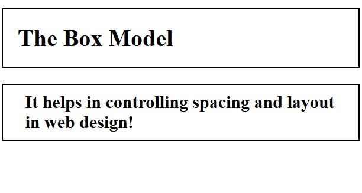

### Margins:

In CSS, a **margin** is the **space around an element, outside of any defined borders**. It is another essential part of the box model. Margins are used to create space between elements, separating them from each other. You can control the margin on all four sides of an element (top, right, bottom and left) independently or using shorthand notation.

#### Basic Syntax:

```css
selector {
    margin-top: value;
    margin-right: value;
    margin-bottom: value;
    margin-left: value;
}
```

#### Breakdown:

* `margin-side`: The margin on the desired side of the element.
* `value`: The desired margin value, which can be specified in pixels (`px`), ems (`em`), percentages (`%`), or other valid CSS units.

#### Using Shorthand Notation:

Similarly to the padding with shorthand notation, the same logic is applied here as well.

```css
p {
    margin: 20px; /* Applies the same margin to all four sides */
}

div {
    margin: 10px 25px; /* Sets top and bottom margin to 10px, and left and right margin to 25px */
}

.button {
    margin: 15px 30px 10px 5px; /* Sets margin for each side individually */
}
```

#### Example of Usage:

```html
<html>
<head>
    <title>Margins</title>
    <style>
        h1 {
            margin-top: 20px;
            margin-right: 20px;
            margin-bottom: 20px;
            margin-left: 20px;
        }
        div {
            margin: 10px 30px;
        }
    </style>
</head>
<body>
    <h1 style="border:2px solid black;">Mastering CSS Margins</h1>
    <div style="border:2px solid black;">Margins create space around elements.</div>
</body>
</html>
```

##### Result:

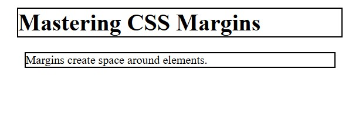

### Borders:

In CSS, a **border** is a **line that surrounds an element**, separating it from other elements and defining its boundaries.

#### Basic Syntax:

```css
selector {
    border-width: value;
    border-style: value;
    border-color: value;
}
```

#### Breakdown:

* `border-width`: This thickness of the border, which can be specified in pixels (`px`), ems (`em`) or other valid CSS units. You can also use keywords like `thin`, `medium` and `thick`.
* `border-style`: The style of the border, which can be one of the following:
    - `dotted`: A series of dots.
    - `dashed`: A series of dashes.
    - `solid`: A solid line.
    - `double`: Two solid lines.
* `border-color`: The color of the border, which can be specified using named colors, hexadecimal values, RGB values or HSL values.

#### Using Shorthand Notation:

You can using shorthand notation to set all three border properties at once:

##### Syntax:

```css
selector {
    border: width style color;
}
```

##### Shorthand Notation Example:

```css
p {
    border: 2px solid blue;
}
```

#### Example of Usage:

```html
<html>
<head>
    <title>Borders</title>
    <style>
        .friday {
            border: 3px solid black;
        }
        .saturday {
            border-width: 4px;
            border-style: dashed;
            border-color: blue;
        }
        .sunday {
            border: 5px dotted green;
        }
    </style>
</head>
<body>
    <div class="friday">
        <h3>Friday</h3>
        <p>7:00 PM - The Inception</p>
    </div>
    <div class="saturday">
        <h3>Saturday</h3>
        <p>8:00 PM - The Matrix</p>
    </div>
    <div class="sunday">
        <h3>Sunday</h3>
        <p>9:00 PM - Interstellar</p>
    </div>
</body>
</html>
```

##### Result:

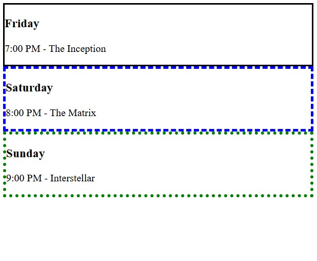

### Width and Height:

In CSS, the **width** and **height** properties are used to set the **dimension of an element's content area**. These properties are essential for controlling the size and layout of elements on your web pages.

#### Basic Syntax:

```css
selector {
    width: value;
    height: value;
}
```

#### Breakdown:

* `width`: The width of the element's content area.
* `height`: The height of the element's content area.
* `value`: The desired margin value, which can be specified in pixels (`px`), ems (`em`), percentages (`%`), or other valid CSS units. You can also use the keyword `auto` to let the browser automatically calculate the width or height based on the content.

#### Example of Usage:

```html
<html>
<head>
    <title>Width and Height</title>
    <style>
        div {
            width: 400px;
            height: 250px;
        }
        img {
            width: 300px;
            height: auto;
        }
    </style>
</head>
<body>
    <div style="border:2px solid black;">This is a division.</div>
    
</body>
</html>
```

##### Result:


### Recap - Box Models Part 1:

Here is a recap based on what we have learned for part 1:

- **Content**: Consists of the actual visible content within the box model.
- **Padding**: The `padding` is the space between the **content of an element and its border**. This property can be used with the specific `padding-side` properties (replace side with top, right, bottom or left) or with shorthand notation with `padding`.
- **margin**: The `margin` is the **space around an element, outside of any defined borders**. This property can be used with the specific `margin-side` property (replace side with top, right, bottom or left) or with shorthand notation with `margin`.
- **Border**: The `border` is a **line that surrounds an element**, separating it from other elements and defining its boundaries. This property has three distinct properties, such as `border-width`, `border-style` and `border-color`, or you can use shorthand notation with `border` to insert all parameters at once.
- **Width and Height**: The `width` and `height` properties are used to set the **dimension of an element's content area**. These properties are essential for controlling the size and layout of elements on your web pages.

#### Example of a Webpage:

```html
<html>
<head>
    <title>Book collection</title>
    <style>
        .book {
            width: 350px;
            height: 150px;
            padding: 15px;
            border: 3px solid black;
            margin: 20px;
        }
    </style>
</head>
<body>
    <div class="book">
        <h3>Harry Potter and the Sorcerer's Stone</h3>
        <p>Author: J.K. Rowling</p>
        <p>Description: A young wizard's journey to defeat a dark wizard.</p>
    </div>

    <div class="book">
        <h3>The Great Gatsby</h3>
        <p>Author: F. Scott Fitzgerald</p>
        <p>Description: A tragic story of wealth, love, and betrayal in the 1920s.</p>
    </div>

    <div class="book">
        <h3>1984</h3>
        <p>Author: George Orwell</p>
        <p>Description: A dystopian novel about totalitarianism and surveillance.</p>
    </div>
</body>
</html>
```

##### Result:


## Box Model Part 2:

### Box Sizing:

The `box-sizing` property determines <i>how the total width and height of an element are calculated.</i> By default, the `width` and `height` properties only include the content's size and do not account for padding, borders, or margins. However, using the `box-sizing` property, you can change this behavior and make the `width` and `height` properties include the padding and border sizes as well. This can simple layout calculations and prevent unexpected sizing issues.

#### Basic Syntax:

```css
selector {
    box-sizing: value;
}
```

The `value` will manipulate with the box-sizing behavior. This value can be one of the following:

* `content-box`: This is the default value. The `width` and `height` properties **only include the content's size**. Padding, borders and margins are added outside of the specified width and height.
* `border-box`: The `width` and `height` properties include the **content, padding and border sizes**. Margins are still added outside of the element.

#### Example of Usage:

```html
<html>
<head>
    <title>Box Sizing</title>
    <style>
        .content-box-div {
            width: 300px;
            height: 200px;
            padding: 20px;
            border: 5px solid blue;
            box-sizing: content-box;
        }
        .border-box-div {
            width: 300px;
            height: 200px;
            padding: 20px;
            border: 5px solid red;
            box-sizing: border-box;
        }
    </style>
</head>
<body>
    <div class="content-box-div">This is a div with content-box.</div>
    <div class="border-box-div">This is a div with border-box.</div>
</body>
</html>
```

#### Breakdown:

In this example, the two `<div>` elements have two distinct class attribute values, such as `content-box-div` and `border-box-div`.

- `.content-box-div`: Within the `.content-box-div` class selector, the `box-sizing` is set to  `content-box`. This means that the actual rendered width of the `<div>` will be `300px` (content) + `40px` (left and right padding) + `10px` (left and right border) = `350px`. The height will be calculated similarly.

- `.border-box-div`: On the other hand, the element with the class `border-box-div` has a `box-sizing` value of `border-box`. In this case, the specified `width` of `300px` will include the content, padding and border. The actual content area will shrink to accommodate the padding and border, resulting in a content width of `300px` - `40px` (left and right padding) - `10px` (left and right border) = `250px`. The height will be calculated similarly.

##### Result:


### Border Radius:

In CSS, the `border-radius` property is used to create **rounded corners for an element**, allowing you to specify the radius of the curvature of each corner, giving you control over the shape of the element's border.

#### Basic Syntax:

Here is the simple syntax for using the `border-radius` property:

```css
selector {
    border-radius: value;
}
```

The `value` will result in the desired radius for the rounded corners, which can be specified in pixels (`px`), percentages (`%`) or other valid CSS units.

- You can specify a single value to apply the same radius to all four corners. In the following example, all `<div>` elements will have rounded corners with a radius of `10px`.

```css
div {
    border-radius: 10px;
}
```

- You can set the different values for each corner individually, using the following order: top-left, top-right, bottom-right and bottom-left.

```css
.button {
    border-radius: 10px 20px 30px 40px;
}
```

- You can also specify only two values, the first value will apply to the top-left and bottom-right corners, and the second value will apply to the top-right and bottom-left corners.

```css
img {
    border-radius: 20px 50px;
}
```

#### Example of Usage:

```html
<html>
<head>
    <title>Border Radius</title>
    <style>
        .one {
            border: 3px solid #4287f5;
            border-radius: 15px;
        }
        .two {
            border: 3px solid magenta;
            border-radius: 10px 3px;
        }
    </style>
</head>
<body>
    <div class="one">This is a division with rounded corners.</div>
    <div class="two">This is another division with rounded corners.</div>
</body>
</html>
```

##### Result:


### Overflow:

In CSS, the `overflow` property <i>controls what happens to content</i> that **overflows its element's box**. When an element's content is too large to fit within the specified width and height, the `overflow` property determines whether to clip the content, add scrollbars, or display the overflowing content outside the element's boundaries.

#### Basic Syntax:

Here's the basic syntax for using the `overflow` property:

```css
selector {
    overflow: value;
}
```

The `value` will represent the desired overflow behavior, which can be one of the following:

* `visible`: This is the default value. Overflowing content is rendered outside the element's box and may overlap adjacent elements.
* `hidden`: Overflowing content is clipped, and the rest of the content is invisible.
* `scroll`: Add two scrollbars (for the horizontal and vertical axis) to the element, allowing users to scroll through the overflowing content.
* `auto`: The browser determines whether to add scrollbars based on the content and available space. Typically, scrollbars are added only when necessary.

#### Demonstration:

Take this HTML document for example:

```html
<!DOCTYPE html>
<html>
<head>
    <title>Testing</title>
    <style>
        h1 {
            text-align: center;
        }
        div {
            width: 200px;
            height: 100px;
            overflow: visible;
        }
    </style>
</head>
<body>
    <div>
        <p>Lorem ipsum dolor sit amet consectetur adipisicing elit. Quidem beatae officia laudantium deleniti suscipit, aperiam sunt ipsa, corporis architecto, facere eveniet ab! Libero accusamus quia eveniet. Aliquam consequatur deleniti delectus!</p>
    </div>
</body>
</html>
```

##### Visible:

For `visible`, you will be able to view all of the available content, noting that this is always the default value when not using the `overflow` property.

```css
div {
    width: 200px;
    height: 100px;
    overflow: visible;
}
```

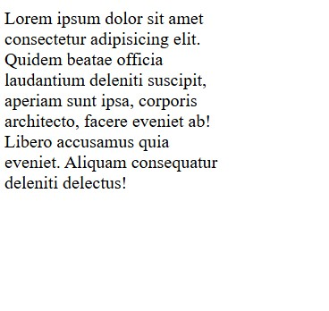

##### Hidden:

The `hidden` value will clip a specific part of the content, depending on the `width` and `height` values, trimming the content into a smaller part, making the rest invisible.

```css
div {
    width: 200px;
    height: 100px;
    overflow: hidden;
}
```

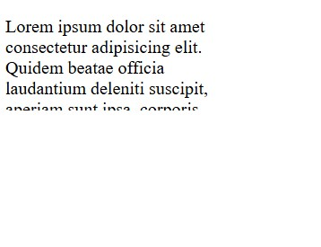

##### Scroll:

The `scroll` give you the control to view the content in a smaller, compact area, with the ability to visualize the contents with the scrollbars, from the horizontal scrollbar to the vertical scrollbar.

```css
div {
    width: 200px;
    height: 100px;
    overflow: scroll;
}
```

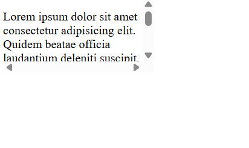

##### Auto:

The `auto` makes the browser think whether to insert a scrollbar, based on the size of the contents, dimensions and available space, possibly generating a much more refined and cleaner overflow demonstration.

```css
div {
    width: 200px;
    height: 100px;
    overflow: auto;
}
```

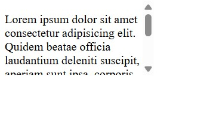

> [!NOTE]
> The horizontal scrollbar was removed because there was enough space to maneuver with the `width` size, and the `<p>` paragraph element is dynamic, when a certain dimension has reached the end of its available width, it will start a new line, but only needing the vertical scrollbar.

#### `Overflow-x` and `overflow-y`:

You can also control the overflow behavior for the horizontal and vertical directions independently using the `overflow-x` and `overflow-y` properties for absolute precision.

```css
.example {
    overflow-x: hidden; /* Hide horizontal overflow */
    overflow-y: scroll; /* Add a vertical scrollbar */
}
```

#### Example of Usage:

```html
<html>
<head>
    <title>Overflow</title>
    <style>
        div {
            width: 300px;
            height: 150px;
            border: 1px solid black;
            overflow: scroll;
        }
    </style>
</head>
<body>
    <div>
        <p>This is a long text that will likely overflow its container. Lorem ipsum dolor sit amet, consectetur adipiscing elit. Sed do eiusmod tempor incididunt ut labore et dolore magna aliqua. Ut enim ad minim veniam, quis nostrud exercitation ullamco laboris nisi ut aliquip ex ea commodo consequat.</p>
    </div>
</body>
</html>
```

##### Result:

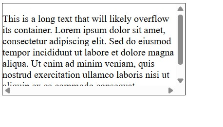

### Box Shadows:

In CSS, the `box-shadow` property is used to **add shadow effects to an element's box**. This property allows you to create visually appealing effects that make elements appear to "pop out" from the page or create depth and dimension.

#### Basic Syntax:

Here's the basic syntax for using the `box-shadow` property:

```css
selector {
    box-shadow: horizontal-offset vertical-offset blur spread color inset;
}
```

#### Breakdown:

- `horizontal-offset`: The horizontal distance of the shadow from the element. Positive values move the shadow to the right, and negative values move it to the left.
- `vertical-offset`: The vertical distance of the shadow from the element. Positive values move the shadow downward, and negative values move it upward.
- `blur` (Optional): The blur radius of the shadow. A larger value creates a more blurred shadow. If omitted, it defaults to 0 (no blur).
- `spread` (Optional): The spread radius of the shadow. Positive values cause the shadow to expand, and negative values cause it to shrink.
- `color` (Optional): The color of the shadow. It can be specified using named colors, hexadecimal values, RGB values or HSL values.
- `inset` (Optional): Changes the shadow from an outer shadow (using `outset`) to an inner shadow (using `inset`).

#### Example of Usage:

```html
<html>
<head>
    <title>Box Shadow</title>
    <style>
        div {
            box-shadow: 10px 10px 5px grey;
        }
        p {
            box-shadow: -5px -5px 10px 2px rgba(0, 0, 0, 0.7);
        }
    </style>
</head>
<body>
    <div>This is a division with a box shadow.</div>
    <br>
    <p>This is a paragraph with a box shadow.</p>
</body>
</html>
```

##### Result:


### Recap - Box Model Part 2:

Now, here's the recap for the box model part 2:

* **`box-sizing`**: A property which determines how the total `width` and `height` values of an element will be calculated, with two possible values:
    - `content-box`: This is the default value. The `width` and `height` properties **only include the content's size**.
    - `border-box`:  The `width` and `height` properties include the **content, padding and border sizes**.
* **`border-radius`**: A property which is used to create **rounded corners for an element**.
* **`overflow`**: A property that controls what happens to content that **overflows its element's box**. There are four values to choose from:
    - `visible`: This is the default value. Overflowing content is rendered outside the element's box and may overlap adjacent elements.
    - `hidden`: Overflowing content is clipped, and the rest of the content is invisible.
    - `scroll`: Add two scrollbars (for the horizontal and vertical axis) to the element, allowing users to scroll through the overflowing content.
    - `auto`: The browser determines whether to add scrollbars based on the content and available space. Typically, scrollbars are added only when necessary.
* **`box-shadow`**: This property is used to **add shadow effects to an element's box**. To manipulate with this property, you must know its syntax: `box-shadow: horizontal-offset vertical-offset blur spread color inset;`.

#### Example of a Webpage:

This is the HTML document for a simple newspaper article:

```html
<html>
<head>
    <title>Newspaper Layout Challenge</title>
    <style>
        div {
            width: 280px;
            height: 150px;
            box-sizing: border-box;
            padding: 15px;
            border: 3px solid #444;
            border-radius: 10px;
            box-shadow: 4px 4px 8px rgba(0, 0, 0, 0.2);
            overflow: scroll;
        }
    </style>
</head>
<body>
    <div class="headline">
        <h3>Biggest Tech Breakthrough of 2025!</h3>
        <p>Scientists have unveiled a revolutionary AI model that can predict climate changes with 99% accuracy.  
        This groundbreaking innovation is expected to transform how governments and organizations respond to global  
        warming, extreme weather events, and natural disasters. Experts believe that integrating AI-driven forecasting  
        with existing climate policies will significantly reduce environmental damage over the next decade.</p>
    </div>
    <div class="article">
        <h3>Opinion: The Future of Web Design</h3>
        <p>As CSS evolves, developers are experimenting with more dynamic layouts and interactive user experiences...</p>
    </div>
</body>
</html>
```

##### Result:


## Flex Box:

### What is a Flex box?

In CSS, the **Flexbox**  layout is a powerful tool that provides an efficient way to **align and distribute space among items in a container**. With Flexbox, you can control the alignment, direction, order and size of elements within a container, creating flexible and dynamic layouts that adapt to different screen sizes and devices.

#### How to use Flexbox:

To be able to manipulate with Flexbox, you will first need to define a **flex container**. This is done by setting the `display` property of an element to the value of `flex` or `inline-flex`. Once you've created a flex container, its direct children automatically become flex items.

#### Basic Syntax:

Here's the basic syntax for creating a flex container:

```css
.container {
    display: flex;
}
```

#### Breakdown:

* `display: flex;`: This declaration turns the selected element into a flex container and its direct children into flex items.

#### After Defining a Flexbox:

Once you have a flex container you can use various Flexbox properties to <i>control the layout of its flex items</i>. Some of the most commonly used properties include:

* `flex-direction`: Specifies the direction of the flex items (row, column, row-reverse and column-reverse).
* `justify-content`: Aligns the flex items along the cross axis (e.g., flex-start, flex-end, center, space-between and space-around).
* `align-items`: Aligns the flex items along the cross axis (e.g., flex-start, flex-end, center, baseline and stretch).
* `flex-wrap`: Controls whether the flex items should wrap onto multiple lines (wrap, nowrap and wrap-reverse).
* `align-content`: Aligns the flex lines when there is extra space in the cross axis (similar to `justify-content` but for multiple lines).

#### Example of Usage:

```html
<html>
<head>
    <title>What is a Flex Box?</title>
    <style>
        .container {
            display: flex;
            justify-content: space-around;
            flex-direction: row-reverse;
        }
    </style>
</head>
<body>
    <div class="container">
        <div>Item 1</div>
        <div>Item 2</div>
        <div>Item 3</div>
    </div>
</body>
</html>
```

##### Result:


### Flex Direction:

In CSS, the `flex-direction` property controls the **direction in which items are arranged** inside a flex container. It decides whether the items are placed in a row or a column. This also affects how properties like `justify-content` and `align-items` work. Using `flex-direction` correctly helps in <i>building flexible and responsible layouts</i>.

#### Basic Syntax:

```css
.container {
    display: flex;
    flex-direction: value;
}
```

#### Breakdown:

The `value` can pursue one of the desired values to determine the direction foe the flex items, which can be one of the following:

* `row`: This is the default value. Flex items are placed in a row from left to right. The main axis is horizontal, and the cross axis is vertical.
* `row-reverse`: Flex items are placed in a row, from right to left. The main axis is horizontal, and the cross axis is vertical.
* `column`: Flex items are placed in a column, from top to bottom. The main axis is vertical, and the cross axis is horizontal.
* `column-reverse`: Flex items are placed in a column, from bottom to top. The main axis is vertical, and the cross axis is horizontal.

#### Example of Usage:

```html
<html>
<head>
    <title>Flex Direction</title>
    <style>
        .container1, .container2 {
            display: flex;
        }
        .container1 {
            flex-direction: column;
        }
        .container2 {
            flex-direction: column-reverse;
        }
    </style>
</head>
<body>
    <div class="container1">
        <div>Item 1</div>
        <div>Item 2</div>
        <div>Item 3</div>
    </div>
    <br>
    <div class="container2">
        <div>Another Item 1</div>
        <div>Another Item 2</div>
        <div>Another Item 3</div>
    </div>
</body>
</html>
```

##### Result:


### Justify Content:

The `justify-content` property controls how flex items are **spaced along the main axis of a flex container**. It helps align items and distribute extra space where there is room left. This property is useful for positioning items horizontally (in a row) or vertically (in a column), making layouts more flexible and responsive.

#### Basic Syntax:

Here's the basic syntax for using the `justify-content` property:

```css
.container {
    display: flex;
    justify-content: value;
}
```

#### Breakdown:

The `value` will represent the desired alignment for the flex items along the main axis, which can be one of the following:

* `flex-start`: This is the default value, items are packed toward the start of the line.
* `flex-end`: Items are packed toward the end of the line.
* `center`: Items are centered along the line.
* `space-between`: Items are evenly distributed along the line, with the first item at the start and the last item at the end.
* `space-around`: Items are evenly distributed along the line, with equal space around them. 
* `space-evenly`: Items are distributed so that the spacing between any two items (and the space to the edges) is equal.

#### Example of Usage:

```html
<html>
<head>
    <title>Justify Content</title>
    <style>
        .fruits, .vegetables {
            display: flex;
        }
        .fruits {
            justify-content: center;
        }
        .vegetables {
            justify-content: space-between;
        }
    </style>
</head>
<body>
    <div class="fruits">
        <div>Apple</div>
        <div>Banana</div>
        <div>Mango</div>
    </div>
    <div class="vegetables">
        <div>Tomato</div>
        <div>Potato</div>
        <div>Cucumber</div>
    </div>
</body>
</html>
```

##### Result:


### Align Items:

In CSS, the `align-items` property controls how **flex items are aligned along the cross axis** (the opposite of the main axis). It helps position items vertically in a row or horizontally in a column. This property is useful for making <i>layouts more flexible and responsive</i>.

#### Basic Syntax:

```css
.container {
    display: flex;
    align-items: value;
}
```

#### Breakdown:

The `value` will determine the alignment for the flex items along the cross axis, which can be one of the following:

* `stretch`: This is the default value. Flex items are stretched to full the container along the cross axis while respecting `min-width` / `max-width` and `min-height` / `max-height`.
* `flex-start`: Flex items are placed at the start of the cress axis.
* `flex-end`: Flex items are placed at the end of the cress axis.
* `center`: Flex items are centered along the cross axis.
* `baseline`: Flex items are aligned such as their baselines align.

#### Example of Usage:

```html
<html>
<head>
    <title>Align Items</title>
    <style>
        .container {
            display: flex;
            height: 200px; /* Added for visualization */
            border: 2px solid darkblue; /* Added for visualization */
        }
        /* Write CSS rules here */
        .seas {
            display: flex;
            align-items: center;
        }
        .oceans {
            display: flex;
            align-items: flex-end;
        }
    </style>
</head>
<body>
    <div class="container">
        <div class="seas">
            <div>Black Sea</div>
            <div>Caribbean Sea</div>
            <div>Dead Sea</div>
        </div>
        <div class="oceans">
            <div>Atlantic Ocean</div>
            <div>Pacific Ocean</div>
            <div>Indian Ocean</div>
        </div>
    </div>
</body>
</html>
```

##### Result:


### The Perfect Center:

In CSS, achieving the <i>"perfect center"</i>, where you would successfully center an element both horizontally and vertically within its parent, is a common layout challenge.

Flexbox provides an elegant and straightforward solution to this problem. By combining the `justify-content` and `align-items` properties, you can easily center a child element within its flex container, regardless of the child's or parent's size.

#### Basic Syntax:

Here is how to achieve the perfect center using Flexbox:

```css
.container {
    display: flex; /* Turn the parent into a flex container */
    justify-content: center; /* Center the child horizontally along the main axis */
    align-items: center; /* Center the child vertically along the cross axis */
}
```

#### Steps to making the Perfect Center:

To make this technique work effectively, ensure that the flex container has a **defined height**. If the container's height is not explicitly set, it will only be as tall as its content, and vertical centering may not be apparent.

Here is an example of how to use this technique in HTML:

```html
<!DOCTYPE html>
<html>
<head>
    <title>The Perfect Center</title>
    <style>
        .container {
            display: flex;
            justify-content: center;
            align-items: center;
            height: 300px; /* Set a specific height for the container */
            border: 1px solid black; /* Optional: Add a border for visualization */
        }

        .child {
            padding: 20px;
            border: 1px solid red;
        }
    </style>
</head>
<body>
    <div class="container">
        <div class="child">This is centered</div>
    </div>
</body>
</html>
```

##### Illustration:


In this example, the `.container` element has a height of `300px` and the `.child` element will be perfectly centered both horizontally and vertically within it.

### Recap - Flex Box:

Here is the recap for the flex box and its main properties:

* **`display`**: Defines and instantiates a new Flexbox by typing `flex` into the value slot to be used within an HTML document. However, it is up to the user whether or not he desires to modify its pre-made Flexbox into another level.
* **`flex-direction`**: A property that controls the **direction in which items are arranged** inside a flex container. It can pursue one of the values:
    - `row`: This is the default value. Flex items are placed in a row from left to right. The main axis is horizontal, and the cross axis is vertical.
    - `row-reverse`: Flex items are placed in a row, from right to left. The main axis is horizontal, and the cross axis is vertical.
    - `column`: Flex items are placed in a column, from top to bottom. The main axis is vertical, and the cross axis is horizontal.
    - `column-reverse`: Flex items are placed in a column, from bottom to top. The main axis is vertical, and the cross axis is horizontal.
* **`justify-content`**: A property that controls how flex items are **spaced along the main axis of a flex container (x-axis)**. Any of these values can be deposited within this property:
    - `flex-start`: This is the default value, items are packed toward the start of the line.
    - `flex-end`: Items are packed toward the end of the line.
    - `center`: Items are centered along the line.
    - `space-between`: Items are evenly distributed along the line, with the first item at the start and the last item at the end.
    - `space-around`: Items are evenly distributed along the line, with equal space around them. 
    - `space-evenly`: Items are distributed so that the spacing between any two items (and the space to the edges) is equal.
* **`align-items`**: A property which will align flex items that are **spaced along the cross axis (opposite of the main axis) of a flex container (y-axis)**. These values can be inserted for manipulation:
    - `stretch`: This is the default value. Flex items are stretched to full the container along the cross axis while respecting `min-width` / `max-width` and `min-height` / `max-height`.
    - `flex-start`: Flex items are placed at the start of the cress axis.
    - `flex-end`: Flex items are placed at the end of the cress axis.
    - `center`: Flex items are centered along the cross axis.
    - `baseline`: Flex items are aligned such as their baselines align.
* **The "Perfect Center"**: A simple technique which requires the management of the `justify-content` and `align-items` properties to align the flex items in the center of the Flexbox. Both of the stored values for there properties must pursue the value of **`center`** for any successes.

#### Example of a Webpage:

```html
<html>
<head>
    <title>Flex Box Challenge</title>
    <style>
        .container {
            display: flex;
            flex-direction: row-reverse;
            justify-content: space-between;
            align-items: flex-end;
        }
        .item1 {
            background-color: lightblue;
            padding: 10px;
        }
        .item2 {
            background-color: lightgreen;
            padding: 20px;
        }
        .item3 {
            background-color: lightcoral;
            padding: 30px;
        }
        .item4 {
            background-color: lightyellow;
            padding: 40px;
        }
    </style>
</head>
<body>
    <div class="container">
        <div class="item1">Item 1</div>
        <div class="item2">Item 2</div>
        <div class="item3">Item 3</div>
        <div class="item4">Item 4</div>
    </div>
</body>
</html>
```

##### Result:


## Layout Techniques:

### Block Vs Inline Elements:

In HTML, elements are categorized as either **block-level** or **inline** elements, based on how they are displayed on the page. Understanding the difference between these two types of elements is crucial for creating well-structured and visually appealing layouts. Let's explore the characteristics and behaviors ob block-level and inline elements.

#### Block-level Elements:

A block-level element always starts on a new line and takes up the full width available, stretching out to the left and right as far as it can. It creates a "block" of content.

##### Examples of Block-level Elements:

* `<div>`
* `<h1>` - `<h6>`
* `<p>`
* `<ul>`, `<ol>`, `<li>`
* `<form>`
* `<table>`
* `<header>`, `<footer>`, `<section>`, `<article>`, `<nav>`...

#### Inline Elements:

An inline element does not start on a new line and only takes up as much width as necessary to fit its content. It allows inline elements to flow within a line of text or inside a block-level element.

##### Examples of Inline Elements:

* `<span>`
* `<a>`
* ``
* `<strong>`, `<em>`
* `<input>`, `<button>`, `<label>`
* `<textarea>`...

#### Visual Explanation:

Mentally imagining these elements in action could be difficult to see being separated by the block-level elements, so here is a simple demonstration of how these elements are separated from each other.

```html
<html>
<head>
    <title>Block vs Inline Elements</title>
    <style>
        div, p, h1 {
            background-color: lightgray;
            border: 1px solid blue;
        }
        span, a, img {
            background-color: lightyellow;
            border: 1px solid red;
        }
    </style>
</head>
<body>
    <div>This is a div element.</div>
    <p>This is a paragraph with a <span>span element</span> inside.</p>
    <h1>This is a heading element.</h1>
    <a href="#">This is a link</a>
    
</body>
</html>
```

#### Result:


### Positioning Basics:

In CSS, the **positioning** is a set of properties that allow you to **control the position of elements on a web page**, and one of the basic properties that you can use is the `position` property. By default, elements are positioned according to the normal flow of the HTML document. However, with CSS positioning, you can take elements out of the normal flow and place them in specific locations relative to their containing element or the viewport.

#### Basic Syntax:

Here's the basic syntax for using the `position` property:

```css
selector {
    position: value
}
```

There are several values for the `position` property, each with its own behavior:

* `static`: This is the default value, the element is positioned according to the normal flow of the document. The `top`, `right`, `bottom` and `left` properties have no effect.
* `relative`: The element is positioned relative to its normal position. Setting the `top`, `right`, `bottom` and `left` properties will move the element away from its normal position, but it still occupies space in the normal flow. 
* `absolute`: The element is removed from the normal flow and positioned relative to its nearest positioned acestor (an ancestor with a position other than `static`). If no positioned ancestor is found, it is positioned relative the the initial containing block (usually the viewport).
* `fixed`: The element is removed from the normal flow and positioned relative to the viewport. It remains fixed in place even when the page is scrolled.
* `sticky`: It positions an element based on the user's scroll position, acting as a hybrid of `relative` and `fixed` positioning.

#### Example of Usage:

```html
<html>
<head>
    <title>Positioning Basics</title>
    <style>
        .container {
            width: 400px;
            height: 300px;
            border: 1px solid black;
            position: relative;
        }
        .box {
            width: 100px;
            height: 100px;
            background-color: lightblue;
            position: absolute;
            top: 50px;
            left: 100px;
        }
    </style>
</head>
<body>
    <div class="container">
        <div class="box"></div>
    </div>
</body>
</html>
```

##### Result:


### Relative Positioning:

In CSS, **relative positioning** is a positioning scheme that allows you to <i>position an element relative to its normal position in the document flow</i>. When an element is set to `position: relative;`, it remains in the normal flow, but you can then use the `top`, `right`, `bottom` and `left` properties to offset it from its original position.

#### Basic Syntax:

Here's the basic syntax for using relative positioning:

```css
selector {
    position: relative;
    top: value;
    right: value;
    bottom: value;
    left: value;
}
```

#### Breakdown:

* `position: relative;`: This declaration sets the element's positioning scheme to relative.
* `top`, `right`, `bottom` and `left`: These properties specify the offset of the element from its normal position. You can use positive or negative values, specified in pixels (`px`), ems (`em`), percentages (`%`), or other valid CSS units.

#### Example of Usage:

In this example, we manipulate with the `position: relative;` property and value to alter the positioning of the green box (`box2`), by moving slightly 20 pixels down and 40 pixels to the right. Down below is the document:

```html
<html>
<head>
    <title>Relative Positioning</title>
    <style>
        .container {
            width: 400px;
            height: 200px;
            border: 1px solid black;
        }
        .box1 {
            width: 100px;
            height: 100px;
            background-color: lightblue;
        }
        .box2 {
            position: relative;
            top: 20px;
            left: 40px;
            width: 100px;
            height: 100px;
            background-color: lightgreen;
        }
        .box3 {
            width: 100px;
            height: 100px;
            background-color: lightcoral;
        }
    </style>
</head>
<body>
    <div class="container">
        <div class="box1">Box 1</div>
        <div class="box2">Box 2</div>
        <div class="box3">Box 3</div>
    </div>
</body>
</html>
```

##### Result:


### Absolute Positioning:

In CSS, the **absolute positioning** lets you place an element **exactly where you want it inside its container**. When you set `position: absolute;`, the element is removed from the normal layout, so other elements act as if it's not there. It positions itself based on the nearest ancestor with a set position (not `static`). If there isn't one, it positions itself relative to the page.

#### Basic Syntax:

```css
.parent {
    position: relative; /* Make the parent a positioned ancestor */
}

.child {
    position: absolute;
    top: value;
    right: value;
    bottom: value;
    left: value;
}
```

#### Breakdown:

* `.parent`: The CSS selector that targets the parent element, setting `position: relative;` allows absolutely positioned children.
* `.child`: The CSS selector that targets the element you want to position absolutely.
* `position: absolute;`: This declaration sets the element's positioning scheme to absolute, removing it from the normal flow.
* `top`, `right`, `bottom` and `left`: These properties specify the position of the element relative to its nearest positioned ancestor. You an use positive or negative values, specified in pixels (`px`), ems (`em`), percentages (`%`) or other valid CSS units.

#### Example of Usage:

```html
<html>
<head>
    <title>Absolute Positioning</title>
    <style>
        .parent {
            position: relative;
            width: 400px;
            height: 300px;
            border: 1px solid black;
        }
        .box1 {
            width: 100px;
            height: 100px;
            background-color: lightblue;
        }
        .box2 {
            position: absolute;
            top: 30px;
            right: 20px;
            width: 150px;
            height: 120px;
            background-color: lightgreen;
        }
    </style>
</head>
<body>
    <div class="parent">
        <div class="box1">Box 1</div>
        <div class="box2">Box 2</div>
    </div>
</body>
</html>
```

##### Result:


### Fixed Positioning:

The **fixed positioning** value keeps an element in the **same spot on the screen**, <i>no matter how much you scroll</i>. When you set `position: fixed;`, the element is removed from the normal layout, so other elements ignore it. It says fixed to the browser window, making it useful for headers, footers, or menus that should always be visible.

#### Basic Syntax:

```css
selector {
    position: fixed;
    top: value;
    right: value;
    bottom: value;
    left: value;
}
```

##### Breakdown:

* `position: fixed;`: This declaration sets the element's positioning scheme to **fixed**.
* `top`, `right`, `bottom` and `left`: These properties specify the positioning of the element relative to the viewport.

#### Example of Usage:

```html
<html>
<head>
    <title>Fixed Positioning</title>
    <style>
    .header {
        position: fixed;
        top: 0px;
        left: 0;
        width: 100%;
        background-color: #fcc726;
        text-align: center;
    }
    </style>
</head>
<body>
    <div class="header">This is the header</div>
    <p>This is some content below the header. Scroll down to see the fixed positioning in action.</p>
    <p>More content here...</p>
    <p>More content here...</p>
    <p>More content here...</p>
    <p>More content here...</p>
    <p>More content here...</p>
    <p>More content here...</p>
    <p>More content here...</p>
    <p>More content here...</p>
    <p>More content here...</p>
    <p>More content here...</p>
    <p>More content here...</p>
    <p>More content here...</p>
    <p>More content here...</p>
    <p>More content here...</p>
    <p>More content here...</p>
    <p>More content here...</p>
    <p>More content here...</p>
    <p>More content here...</p>
</body>
</html>
```

##### Result:

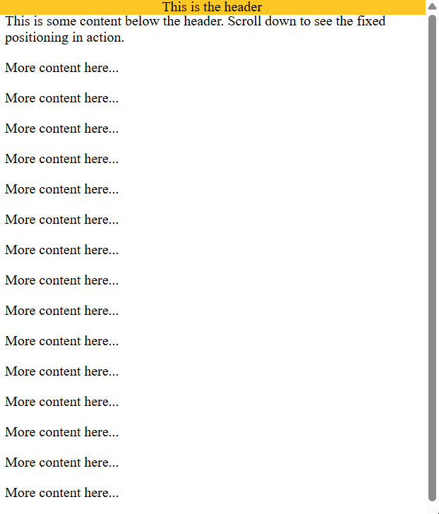

### Z-Index Basics:

In CSS, the `z-index` property controls the **stacking order of positioned elements (elements with a position other that `static`)**. When elements overlap, the `z-index` determines <i>which element appears on top and which appears behind</i>. Elements with a higher `z-index` value are stacked in from of the elements with a lower value.

#### Basic Syntax:

Here's the basic syntax for using the `z-index` property:

```css
selector {
    position: relative; /* or absolute, fixed, or sticky */
    z-index: value;
}
```

#### Breakdown:

* `position: relative;` (or `absolute`, `fixed` or `sticky`): The element must be positioned for `z-index` to have an effect.
* `value`: An integer value that represents the stacking order. Elements with higher values are stacked in front of elements with lower values. The value can be positive, negative, or zero.

#### Example of Usage:

```html
<html>
<head>
    <title>Z-Index Basics</title>
    <style>
        .box1 {
            position: absolute;
            top: 0;
            left: 0px;
            width: 100px;
            height: 100px;
            background-color: lightblue;
            z-index: 3;
        }
        .box2 {
            position: absolute;
            top: 20px;
            left: 20px;
            width: 150px;
            height: 150px;
            background-color: lightgreen;
            z-index: 2;
        }
        .box3 {
            position: absolute;
            top: 40px;
            left: 40px;
            width: 200px;
            height: 200px;
            background-color: lightcoral;
            z-index: 1;
        }
    </style>
</head>
<body>
    <div class="box1">Box 1</div>
    <div class="box2">Box 2</div>
    <div class="box3">Box 3</div>
</body>
</html>
```

##### Result:

> [!NOTE]
> Observe how the z-index values affect the stacking order of the boxes, with box1 on top and box3 at the bottom.


### Recap - Layout Techniques:

Let's recap on what we have learned in this topic!

* **Block-level Elements**: Elements that pursue an opening and closing tag, where they always start on a new line and takes up the full width available, creating a "block" of content, this includes the vast majority of tags like divisors, paragraphs, semantic tags and etc:
    - `<div>`
    - `<h1>` - `<h6>`
    - `<p>`
    - `<ul>`, `<ol>`, `<li>`
    - `<form>`
    - `<table>`
    - `<header>`, `<footer>`, `<section>`, `<article>`, `<nav>`...
* **Inline Elements**: Elements that do not start on a new line and only takes up as much width as necessary to fit its content. It allows inline elements to flow within a line of text or inside a block-level element, this include <i>self-closing tags</i>:
    - `<span>`
    - `<a>`
    - ``
    - `<strong>`, `<em>`
    - `<input>`, `<button>`, `<label>`
    - `<textarea>`...
* `position`: An attribute which **controls the positioning of elements** and content on a web page. There are several values for this property:
    - `static`: This is the default value, the element is positioned according to the normal flow of the document. The `top`, `right`, `bottom` and `left` properties have no effect.
    - `relative`: The element is positioned relative to its normal position. Setting the `top`, `right`, `bottom` and `left` properties will move the element away from its normal position, but it still occupies space in the normal flow. 
    - `absolute`: The element is removed from the normal flow and positioned relative to its nearest positioned acestor (an ancestor with a position other than `static`). If no positioned ancestor is found, it is positioned relative the the initial containing block (usually the viewport).
    - `fixed`: The element is removed from the normal flow and positioned relative to the viewport. It remains fixed in place even when the page is scrolled.
    - `sticky`: It positions an element based on the user's scroll position, acting as a hybrid of `relative` and `fixed` positioning.
* `z-index`: A property which controls the **stacking order of positioned elements (elements with a `position` other that `static`)**. You can control this factor by modifying the value, which must be an integer (1, 5, -3, ...), the higher the int value, <i>the closer the element will be to being in front of the stack</i>.

#### Example of a Webpage:

```html
<!DOCTYPE html>
<html lang="en">
<head>
    <meta charset="UTF-8">
    <meta name="viewport" content="width=device-width, initial-scale=1.0">
    <title>Pizza Restaurant</title>
    <style>
        /* Fixed Header */
        header {
            background-color: #ff6f61;
            padding: 20px;
            text-align: center;
            font-size: 24px;
            color: white;
            position: fixed;
            top: 0;
            left: 0;
            width: 100px;
            z-index: 10;
        }
        /* Menu Section (Relative) */
        .menu {
            margin-top: 70px; /* Space for fixed header */
            padding: 20px;
            background-color: #f8f8f8;
            font-size: 18px;
            position: relative;
        }
        /* Promotions Box (Absolute) */
        .promotions {
            background-color: #ffdf00;
            padding: 10px;
            font-size: 20px;
            border-radius: 10px;
            position: absolute;
            top: 100px;
            right: 20px;
            z-index: 5;
        }
    </style>
</head>
<body>
    <!-- Fixed Header -->
    <header>
        Pizza Restaurant
    </header>
    <!-- Menu Section -->
    <div class="menu">
        <h2>Our Menu</h2>
        <ul>
            <li>Margherita</li>
            <li>Pepperoni</li>
            <li>Veggie</li>
            <li>Hawaiian</li>
        </ul>       
        <p>Order now and enjoy!</p>
    </div>
    <!-- Promotions Box -->
    <div class="promotions">
        <p>Get 20% off your first order!</p>
    </div>
    <div class="pizza-info">
        <h2>About Pizza</h2>
        <p>Pizza, a dish with origins in Italy, is one of the world's most beloved foods. It was first made in Naples during the 18th century, with the classic Margherita pizza being named after Queen Margherita of Savoy. The traditional pizza is known for its simple ingredients: a thin crust, tomato sauce, mozzarella cheese, and fresh basil.</p>
        <p>Over the years, pizza has evolved into a variety of regional styles, from thin-crust New York-style pizza to deep-dish Chicago pizza. While the toppings have diversified, the tradition of sharing a pizza with family and friends remains an essential part of the pizza experience.</p>
        <p>In Italy, pizza is often enjoyed casually, typically paired with a glass of wine or soda. It is a symbol of Italian culture, and many believe that a good pizza is a representation of the country's culinary expertise and passion for food.</p>
        <p>Pizza's global reach has led to many variations and adaptations in different countries. In Japan, for example, toppings like teriyaki chicken and squid are popular, while in Brazil, green peas and corn are commonly found on pizzas. In the United States, pizza has become a staple of fast food, with different regions offering their unique twists, such as the deep-dish pizza from Chicago and the thin crust of New York City.</p>
    </div>
</body>
</html>
```

##### Result:

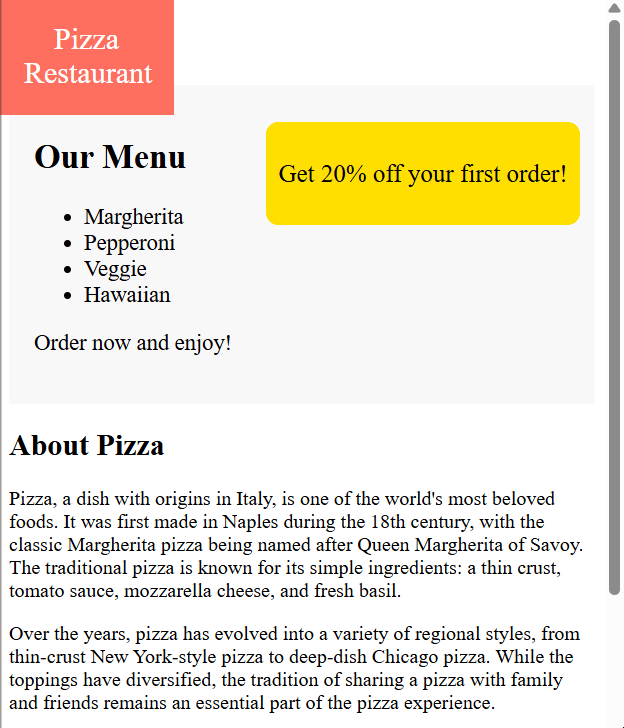

## Responsive Design Basics:

### What is Responsive Design?

In web design, the **responsive design** is an approach that aims to create web pages that adapt and provide an optimal viewing experience across a wide range of devices, <i>from desktop computer monitors to mobile phones</i>.

A responsive website automatically adjusts its layout, content, and functionality based on the screen size, resolution, and orientation of the device it is being viewed on. The goal of responsive design is to ensure that users can easily access and interact with the website, regardless of the device they are using.

#### The Techniques of Responsive Design:

Responsive design is achieved through a combination of techniques, including:

* **Flexible grids and layouts**: Using CSS grid or Flexbox to create layouts that can adapt to different screen sizes, making the website more dynamic for the user.
* **Flexible images and media**: Ensuring that images and other media scale proportionally with the layout.
* **Media queries**: Applying different CSS styles based on the characteristics of the device, such as screen width, height, and orientation.

As more people use mobile devices to browse the web, responsive design is essential for making websites easy to use. It ensures your site looks good and works well on any device, giving users a smooth and consistent experience.

#### Use of Viewport:

Use **viewport** units for responsive typography:

```css
h1 {
    font-size: 5vw;
}
p {
    font-size: 3vw;
}
```

#### Proper Scaling:

Make images responsive with proper scaling:

```css
/* Fixed height - causes distortion */
.fixed-height {
  width: 100%;
  height: 150px;
}

/* Auto height - maintains aspect ratio */
.auto-height {
  width: 100%;
  height: auto;
}
```

#### Example of Usage:

```html
<!DOCTYPE html>
<html lang="en">
<head>
    <meta charset="UTF-8">
    <meta name="viewport" content="width=device-width, initial-scale=1.0">
    <title>What is Responsive Design?</title>
    <style>
        h1 {
            font-size: 5vw;
        }
        p {
            font-size: 3vw;
        }
        .fixed-height {
            width: 100%;
            height: 150px;
        }
        .auto-height {
            width: 100%;
            height: auto;
        }
        .container {
            width: 300px;
            border: 2px solid #ccc;
            margin: 20px;
            padding: 10px;
        }
    </style>
</head>
<body>
    <h1>Mount Everest: The World's Highest Peak</h1>
    <p>Mount Everest, standing at 8,848.86 meters (29,031.7 feet), is the tallest mountain on Earth. Located in the Himalayas on the border between Nepal and Tibet, it attracts climbers from around the world. Scaling Everest is a challenging journey due to its extreme weather, thin air, and rough terrain.</p>
    
    <div class="container">
        <h3>Fixed Height (Distorted)</h3>
        
    </div>
    
    <div class="container">
        <h3>Auto Height (Preserved Aspect Ratio)</h3>
        
    </div>
</body>
</html>
```

##### Result:


### Viewport Meta Tag:

The **viewport tag** controls layout and scaling on different devices, particularly mobile. It's placed in the `<head>` section for responsive eb design.

#### Basic Syntax:

```html
<meta name="viewport" content="name=value, name=value">
```

#### Breakdown:

These are the common viewport settings:

* `width=device-width`: Sets viewport width to device screen width.
* `initial-scale=1.0`: Sets initial zoom level (1.0 = no zoom).
* `maximum-scale=1.0`: Sets maximum zoom level.
* `minimum-scale=1.0`: Sets minimum zoom level.

#### Example of Usage:

```html
<!DOCTYPE html>
<html lang="en">
<html>
<head>
    <meta charset="UTF-8">
    <meta name="viewport" content="width=device-width, initial-scale=1.0">
    <title>Viewport Meta Tag</title>
</head>
<body>
    <h1>Responsive Web Page</h1>
    <p>This page uses the viewport meta tag to adapt to different screen sizes.</p>
</body>
</html>
```

##### Result:


### Fluid Layouts:

In responsive web design, a **fluid layout** adjusts to different screen sizes using flexible grids and relative units like percentages instead of fixed pixel values. This helps the layout expand or shrink to fit any screen, ensuring a smooth user experience on all devices.

#### Key Principles:

The key principles of fluid layouts include:

1. **Relative Units**: Using percentages (`%`), viewport units (`vw`, `vh`), or ems (`em`) instead of fixed pixels (`px`) for widths, heights, margins and padding.
2. **Flexible Grids**: Using CSS Grid or Flexbox to create grid-based layouts that can adapt to different screen sizes.
3. **Max-width and min-width**: Setting maximum and minimum widths for elements to prevent them from becoming too wide or too narrow on extreme screen sizes.

#### Example of Usage:

```html
<html>
<head>
    <title>Fluid Layouts</title>
    <style>
        .container {
            width: 80%;
            margin: 0 auto;
            border: 1px solid black;
        }
        .sidebar {
            width: 25%;
            float: left;
        }
        .main {
            width: 75%;
            float: right;
        }
    </style>
</head>
<body>
    <div class="container">
        <div class="sidebar" style="background-color:#92f0ab">Sidebar</div>
        <div class="main" style="background-color:#92d4f0">Main Content</div>
    </div>
</body>
</html>
```

In this example, the `.container` element has a fluid width of `80%`, which means it will always take up 80% of the viewport width. The `margin` is set to `0` on `auto`, centering the layout of the `.container` divisor, setting the top and bottom margins to zero and automatically making the browser calculate the equal margins for the left and right sizes. The `.sidebar` element will occupy the `width` of `25%` in the `.container` while the `.main` occupies `75%`, the `.sidebar` has the `float` value of `left`, pushing the element to the left side of the container, rather than stacking underneath `.main`, and `.main` pursues the `float` of `right`.

##### Result:

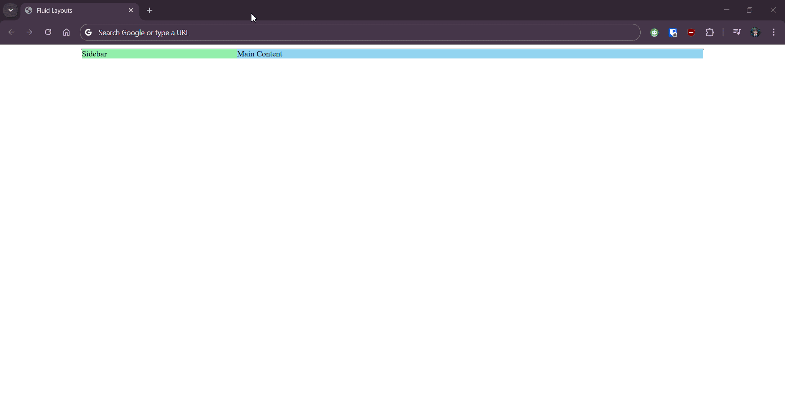

### Viewport Units:

In CSS, viewport units are relative units of measurement that are based on the **size of the browser's viewport (the visible re of the web page)**. They provide a way to create responsive designs by <i>sizing elements and text proportionally to the width or height of the viewport</i>. Viewport units are particularly useful for creating fluid layouts, scaling text, and positioning elements in a way that adapts to different screen sizes.

#### Introducing the Four Viewport Units:

There are four viewport units:

1. **vw (viewport width)**: Represents 1% of the viewport's width. For example, `10vw` is equal to 10% of the viewport width.
2. **vh (viewport height)**: Represents 1% of the viewport's height. For example, `25vh` is equal to 25% of the viewport height.
3. **vmin (viewport minimum)**: Represents 1% of the smaller dimension of the viewport (width or height). For example, if the viewport is wider that it is tall, `5vmin` is equal to 5% of the viewport height.
4. **vmax (viewport maximum)**: Represents 1% of the larger dimension of the viewport (width or height). For example, if the viewport is wider that it is tall, `8vmax` is equal to 8% of the viewport width.

#### Basic Syntax:

Here's the basic syntax for using viewport units:

```css
selector {
    property: value;
}
```

#### Breakdown:

* `selector`: The CSS select that targets the HTML element(s) you want to style.
* `property`: The CSS property you want to set (e.g. `width`, `height`, `font-size`, `margin`, `padding`).
* `value`: A value that includes viewport units (e.g. `50vw`, `75vh`, `10vmin`, `5vmax`).

#### Example of Usage:

```html
<!DOCTYPE html>
<html lang="en">
<html>
<head>
    <meta charset="UTF-8">
    <meta name="viewport" content="width=device-width, initial-scale=1.0">
    <title>Viewport Units</title>
    <style>
        body {
            background-color:lightblue;
        }
        h1 {
            font-size: 6vw;
        }
        p {
            font-size: 4vmin;
        }
        div {
            width: 80vw;
            height: 50vh;
        }
    </style>
</head>
<body>
    <h1>Antarctica</h1>  
    <p>The coldest continent, covered in ice and home to penguins and seals.</p>  
    <div>It has no permanent residents, only research stations.</div>
</body>
</body>
</html>
```

##### Result:

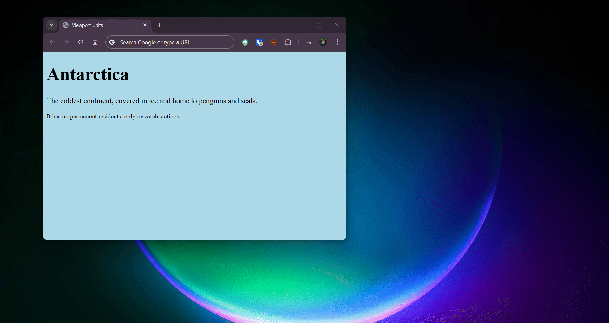

### Media Queries Basics:

A **media query** in CSS allows a website to **adapt to different sizes** by applying styles based on device width, height, or other properties.

#### Basic Syntax:

Here is the basic syntax for Media Queries:

```css
@media (condition) {
    selector {
        property: value;
    }
}
```

#### Breakdown:

* `condition`: The rule that triggers the styles (e.g. `max-width: 600px`).
* `selector`: The HTML element(s) to style.
* `property`: The CSS property to set (e.g. `width`, `font-size`).
* `value`: The values assigned to the property, which changed based on the media query condition.

#### How Media Queries Work:

In a media query, the `condition` can be based on values factors like screen size, resolution, and more. Some common conditions include:

* `max-width`: Limits styles to screens with a maximum width (e.g. `max-width: 600px).
* `min-width`: Applies styles to screens with a minimum width (e.g. `min-width: 758px`).
* `max-height`: Limits styles to screens with a maximum height (e.g. `max-height: 400px`).
* `min-height`: Applies styles to screens ith a minimum height (e.g. `min-height: 500px`).

These conditions help you control how your website looks on different devices and orientations.

#### Example of Usage:

```html
<!DOCTYPE html>
<html lang="en">
<html>
<head>
    <meta charset="UTF-8">
    <meta name="viewport" content="width=device-width, initial-scale=1.0">
    <title>Media Queries Basics</title>
    <style>
        @media (max-width: 600px) {
            body { background-color: lightblue; }
            h1 { font-size: 5vw; }
        }

        @media (min-width: 601px) and (max-width: 1024px) {
            body { background-color: lightgreen; }
            h1 { font-size: 3vw; }
        }

        @media (min-width: 1025px) {
            body { background-color: lightcoral; }
            h1 { font-size: 2vw; }
        }
    </style>
</head>
<body>
    <h1>Whales: The Ocean Giants</h1>
    <p>Whales are magnificent giants of the sea, famous for their intelligence and powerful songs. These gentle creatures face threats like hunting and pollution, making them vital to protect.</p>
    <div>As ocean's true giants, whales help maintain the delicate balance of marine life.</div>
</body>
</html>
```

> [!NOTE]
> As we expand the width of your current window, the background color of the webpage alters and same for the header!

##### Result:

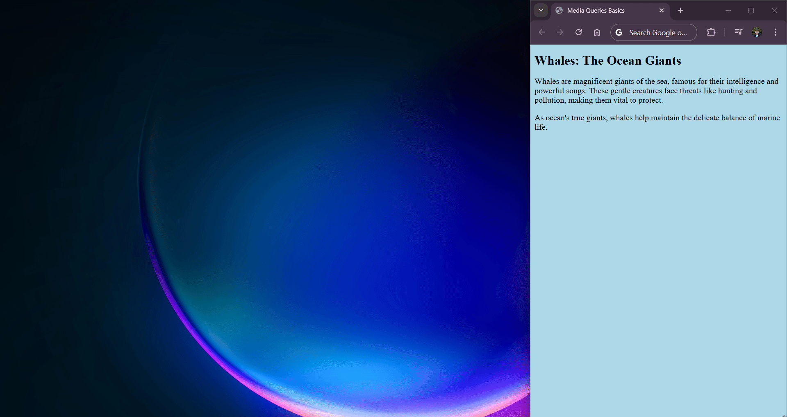

### Flexible Images:

In responsive web design, **flexible images** automatically adjust to fit different screen sizes, ensuring they look good on all devices. Without flexibility, images may be too large on small screens or break the layout.

#### Steps to making Flexible Images:

1. **Use CSS `max-width`**:
Setting `max-width: 100%` ensures that images never exceed their container width.

```css
img {
    max-width: 100%;
    height: auto; /* Maintains aspect ratio */
}
```

2. **USe Viewport Units**:
You can size images using **`vw` (viewport width)** to make them scale with the screen size.

```css
img {
    width: 50vw; /* Image takes up 50% of viewport width */
}
```

#### Example of Usage:

```html
<!DOCTYPE html>
<html lang="en">
<html>
<head>
    <meta charset="UTF-8">
    <meta name="viewport" content="width=device-width, initial-scale=1.0">
    <title>Flexible Images</title>
    <style>
        body {
            background-color:lightblue;
        }
        .img-max {
            max-width: 100%;
            height: auto;
        }
        .img-vw {
            width: 50vw;
            height: auto;
        }
    </style>
</head>
<body>
    <div class="container">
        <h2>Image with max-width: 100%</h2>
        
    </div>

    <div class="container">
        <h2>Image with width: 50vw</h2>
        
    </div>
</body>
</html>
```

##### Result:

